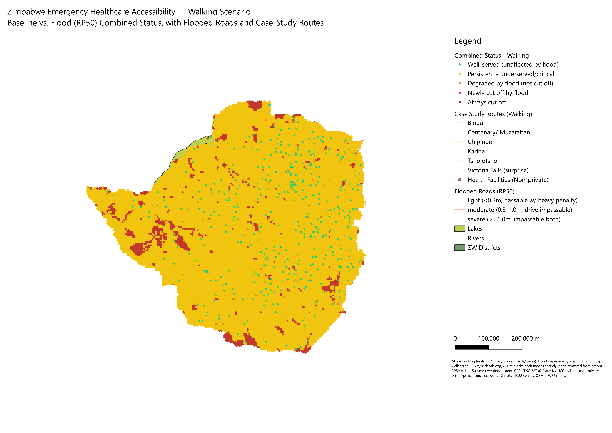

# Emergency Healthcare Accessibility in Zimbabwe

A national analysis of travel time to public emergency healthcare in Zimbabwe, under normal conditions and during a modelled 1-in-50-year river flood (RP50) — for both driving and walking. Built for identifying underserved communities and communities at risk of being cut off from care during flooding.

**Full technical report:** [`report/ZW_Health_Access_Technical_Report.docx`](report/ZW_Health_Access_Technical_Report.docx) — methodology, data sources and limitations, national results, the two maps below, and six community case studies written in plain language.

## Key findings

- Under normal conditions, **64.9% of the population (9.84M people)** is well-served by vehicle (under 30 minutes to the nearest of 1,486 public health facilities), but only **16.0% (2.43M people)** is well-served on foot. This driving/walking gap is one of the central findings of the analysis: for a large share of the country, "well-served" depends on vehicle access, not physical distance to care.
- Under the flood scenario, **323,420 people** who are reachable at baseline by vehicle become completely cut off (no surviving route, checked exhaustively, by any path). **260,267 people** are newly cut off on foot.
- Six representative communities were traced route-by-route as case studies; in every one, the flood leaves no surviving path to care by either mode.

## Maps

| Driving | Walking |
|---|---|
|  |  |

Each map combines baseline and flood results into one four-category picture: well-served and unaffected by the flood, persistently underserved/critical, degraded by flood (not cut off), and newly cut off by flood. Full-resolution PNGs are in [`maps/`](maps/).

## Repository structure

```
data/processed/     Final analysis outputs (GeoPackages + rasters), see table below
docs/                Full development log (methodology, decisions, data-quality fixes)
maps/                The two report maps, full resolution PNG
qgis/                Live QGIS project (EPSG:32736) with all layers, styling, and print layouts
report/              The full technical report (.docx)
scripts/             Python scripts implementing every analysis phase, in order
```

### `data/processed/` contents

| File | Description |
|---|---|
| `admin_boundaries.gpkg` | Country / province / district boundaries (geoBoundaries) |
| `health_facilities.gpkg` | 1,486 public, non-restricted-access health facilities used as destinations |
| `health_facilities_classified_ALL.csv` / `_EXCLUDED.csv` | Every source facility row with its inclusion/exclusion reasoning — see the data-quality note below |
| `population_2022_calibrated_district.tif` | WorldPop 2020 density, calibrated to 2022 census totals at district level |
| `population_points_5km_2022.gpkg` | 15,894-point population-weighted grid — the "communities" used throughout |
| `roads_network_part1-5.gpkg` | Merged road network (OSM + WFP humanitarian data), 30,619 segments / 131,349 km, split into 5 files for a friendlier per-file size |
| `flood_hazard_RP50_depth.tif` | JRC/Copernicus 1-in-50-year river flood depth (m) |
| `flooded_roads_RP50.gpkg` | Road segments intersecting the flood extent, with depth and severity |
| `baseline_accessibility_5km_drive_and_walk.gpkg` | Per-point baseline travel time/class/nearest facility, both modes |
| `flood_accessibility_5km.gpkg` | Per-point baseline + flood-scenario results, both modes |
| `combined_status_drive.gpkg` / `combined_status_walk.gpkg` | The four-category combined status behind the two maps above |
| `case_study_routes.gpkg` | The six case-study routes (driving + walking), and every flooded point along them |

## Data sources

| Dataset | Source | License |
|---|---|---|
| Administrative boundaries | [geoBoundaries](https://www.geoboundaries.org), Zimbabwe ADM0/1/2 | CC BY 4.0 (attribution required) |
| Roads | OpenStreetMap (via Overpass), merged with [WFP/Humanitarian Data Exchange](https://data.humdata.org) roads+trails | ODbL (OSM); check WFP dataset page |
| Health facilities | Zimbabwe Ministry of Health and Child Care (MoHCC) master facility list, via HDX | See HDX dataset page |
| Population | [WorldPop](https://www.worldpop.org) 2020 gridded population, calibrated to Zimbabwe's 2022 census (ZimStat) | CC BY 4.0 (WorldPop) |
| Flood hazard | JRC/Copernicus Global River Flood Hazard Maps, RP50 | See [Copernicus data policy](https://www.copernicus.eu) |

Raw source files are not redistributed in this repository (external license terms, and some are large); `data/processed/` contains only derived outputs built from them. See `scripts/` for exactly how each output was built, and re-download the raw sources from the links above if you want to reproduce from scratch.

## Data-quality note: restricted-access facilities

The source facility list's ownership field does not reliably flag prison/police clinics as distinct from ordinary public ones — both are commonly coded identically. This project explicitly excludes all facilities serving only inmates or staff, not the public (per the project owner's instruction). An initial pass caught 8 such facilities by name/ownership code; 14 more, all containing "ZRP" (Zimbabwe Republic Police) in their name, were only found later during case-study selection, when one resolved as a community's "nearest facility." Before that correction, 164,084 people (1.1% of the national population) had one of those 14 facilities as their computed nearest facility. See `scripts/02_filter_health_facilities.py` for the full exclusion logic and `docs/METHODOLOGY_LOG.md` for the complete story — flagged here because it's a data-quality lesson worth knowing before trusting any similar facility dataset at face value.

## Reproducing the analysis

```
pip install -r requirements.txt
python scripts/01_prepare_population.py          # WorldPop -> census-calibrated raster
python scripts/02_filter_health_facilities.py     # raw MoHCC list -> included/excluded facilities
python scripts/03_build_population_points.py      # raster -> 5km population-weighted grid
python scripts/04_build_road_network.py           # merge OSM + WFP roads
python scripts/05_build_routing_graph.py          # roads -> routable graph (scipy.sparse)
python scripts/06_baseline_accessibility.py       # nearest-facility travel time, both modes
python scripts/07_flood_scenario.py               # flood-penalized re-run, both modes
python scripts/08_combined_status.py              # 4-category combined baseline+flood status
python scripts/09_case_studies.py                 # 6 representative routes, flood cut-points
```

Steps 05–09 were re-run end-to-end while preparing this repository and reproduce the report's national totals to within roughly half a percentage point, and select the identical six case-study communities. Steps 01–04 depend on raw source data not included here (see Data Sources); minor district-name crosswalk edge cases in step 01 and a broader restricted-facility name match in step 02 mean a from-scratch re-run of the full pipeline may not reproduce `data/processed/` bit-for-bit — the shipped files are the final, reviewed versions used in the report, and are the authoritative source of truth. The scripts are provided for methodology transparency and reuse, not as a guarantee of identical output in every environment.

Each script is a standalone CLI (`--help` for options) and can be run independently against its documented inputs — you don't need to run the full chain to, say, re-filter the facility list or re-check the flood-penalty logic.

## Methodology summary

Travel time is computed with a custom routing model, not QGIS's usual QNEAT3 plugin (not yet available for the QGIS 4.x release used on this project): every road-network vertex becomes a node in a `scipy.sparse` graph (~1.76M nodes, ~1.77M edges), coordinate-snapped at 5m to merge duplicate vertices across data sources, with edge weight = travel time from an assumed speed by road class. A single multi-source Dijkstra search (`scipy.sparse.csgraph.dijkstra`, `min_only=True`), seeded from all facilities at once, computes the nearest facility and travel time for every community in about a second — for both a driving-speed graph and a uniform 4.5 km/h walking-speed graph, run as two parallel scenarios rather than one.

The flood scenario samples flood depth at every routing-graph edge's midpoint and applies an explicit, depth-tiered passability rule (edges under 0.3m get a heavy speed penalty; 0.3–1.0m is impassable by vehicle but wadeable on foot; 1.0m and over is impassable for both modes and removed from the graph entirely), then re-runs the identical search against the penalized graph. See `report/ZW_Health_Access_Technical_Report.docx` (Section 3) for the full methodology, including the international benchmark this project's 30/60-minute accessibility bands are a finer-grained adaptation of (the Lancet Commission on Global Surgery's two-hour access indicator), and `docs/METHODOLOGY_LOG.md` for the complete, phase-by-phase development history.

## Limitations

The report's Section 2 and Section 8.4 cover this in full; briefly: this analysis measures *geographic* reach (travel time to the nearest facility), not whether that facility can actually treat a given emergency — most Zimbabwean clinics have no surgical capacity, and the health system is under real strain, so true delay to adequate care is understated here. It also assumes every mapped road is passable at its assumed class speed, which does not account for road condition — Zimbabwe's rural road network in particular is not uniformly well maintained, so modelled driving times should be read as a best-case, infrastructure-permitting estimate. The flood model (RP50) captures river/valley flooding only, not urban flash flooding. See the report for the complete limitations discussion.

## License

Code in `scripts/` and `qgis/` is released under the MIT License (see `LICENSE`). Data in `data/processed/` is derived from the third-party sources listed above and remains subject to their original licenses and attribution requirements — geoBoundaries and WorldPop both require attribution under CC BY 4.0; OpenStreetMap-derived road data is under ODbL. The report and maps may be shared with attribution to this repository.
